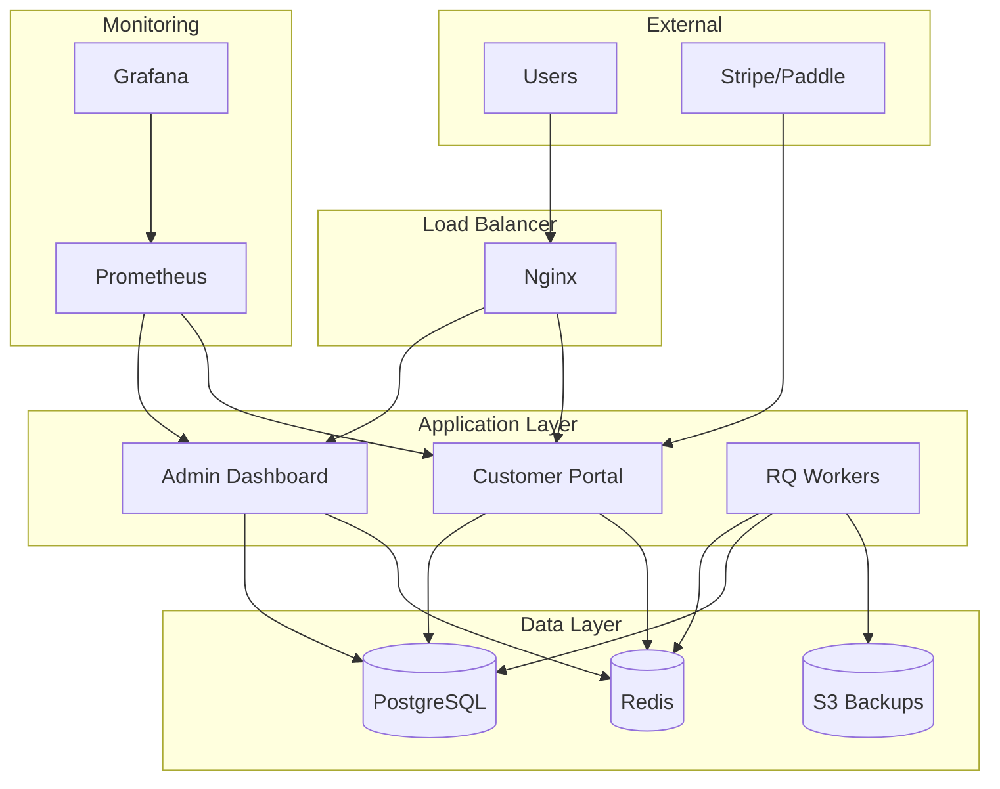

# Odoo SaaS Platform

A production-grade, multi-tenant Odoo deployment platform with automated provisioning, comprehensive billing integration, and enterprise-ready operations.

## 🚀 Features

### Core Platform
- **Multi-Tenant Architecture**: One PostgreSQL database per tenant with complete isolation
- **Admin Dashboard**: Comprehensive operator interface for managing tenants, customers, and platform
- **Customer Portal**: Self-service interface for tenant management and billing
- **Role-Based Access Control**: Granular permissions with Owner/Admin/Viewer roles
- **Audit Logging**: Immutable audit trail for all platform operations

### Enterprise Features
- **Automated Backups**: S3 storage with KMS encryption and lifecycle management
- **Billing Integration**: Stripe & Paddle support with webhooks and plan management
- **Module Management**: Per-tenant Odoo module installation and management
- **Background Jobs**: Redis/RQ-based async processing with retries and monitoring
- **Monitoring**: Prometheus metrics, health checks, and Grafana dashboards

### Deployment Options
- **Docker**: Development and production-ready Docker Compose configurations
- **Kubernetes**: Full K8s manifests with HPA, KEDA autoscaling, and cert-manager
- **Bare Metal**: systemd services with Nginx and Let's Encrypt automation

## 📋 Quick Start

### Prerequisites
- Docker & Docker Compose
- Python 3.9+
- PostgreSQL 15+
- Redis 7+

### Development Setup

1. **Clone the repository**:
   ```bash
   git clone <repository-url>
   cd odoo-saas-platform
   ```

2. **Set up environment**:
   ```bash
   cp .env.example .env
   # Edit .env with your configuration
   nano .env
   ```

3. **Start the platform**:
   ```bash
   docker-compose up -d --build
   ```

4. **Initialize the database**:
   ```bash
   # Run migrations
   docker-compose exec admin alembic upgrade head
   
   # Seed initial data (optional)
   SEED_DEMO_DATA=true docker-compose exec admin python scripts/seed_data.py
   ```

5. **Access the platform**:
   - Admin Dashboard: http://admin.localhost
   - Customer Portal: http://portal.localhost
   - RQ Dashboard: http://localhost:9181
   - Grafana: http://localhost:3000
   - Prometheus: http://localhost:9090

### Default Credentials (Demo Data)
- **Admin User**: admin@example.com / admin123
- **Demo Customer**: demo@example.com / demo123
- **Grafana**: admin / admin123

## 🏗️ Architecture



## 🔧 Configuration

### Environment Variables

Key configuration options in `.env`:

```bash
# Core Platform
DOMAIN=your-domain.com
SECRET_KEY=your-secret-key
ENVIRONMENT=production

# Database
PG_HOST=postgres
PG_USER=odoo
PG_PASSWORD=secure-password
PG_DATABASE=odoo_saas_platform

# Redis
REDIS_HOST=redis
REDIS_PASSWORD=secure-redis-password

# Billing
STRIPE_SECRET_KEY=sk_live_...
STRIPE_SIGNING_SECRET=whsec_...
PADDLE_PUBLIC_KEY_BASE64=...

# S3 Backups
AWS_ACCESS_KEY_ID=AKIA...
AWS_SECRET_ACCESS_KEY=...
S3_BUCKET=odoo-saas-backups
S3_KMS_KEY_ID=arn:aws:kms:...

# Monitoring
SLACK_WEBHOOK_URL=https://hooks.slack.com/...
GRAFANA_ADMIN_PASSWORD=secure-password
```

### Plans Configuration

The platform supports multiple billing plans configured in the database:

- **Free Plan**: 1 tenant, 3 users, 1GB storage
- **Starter Plan**: 1 tenant, 10 users, 5GB storage, $29/month
- **Professional Plan**: 3 tenants, 25 users, 20GB storage, $79/month  
- **Enterprise Plan**: 10 tenants, 100 users, 100GB storage, $199/month

## 🚀 Deployment

### Production Deployment (Docker)

1. **Set up production environment**:
   ```bash
   cp .env.example .env.prod
   # Configure production values
   nano .env.prod
   ```

2. **Deploy with production compose**:
   ```bash
   docker-compose -f docker-compose.prod.yml --env-file .env.prod up -d
   ```

3. **Set up SSL certificates**:
   ```bash
   # Enable Let's Encrypt
   docker-compose -f docker-compose.prod.yml --profile ssl up -d
   ```

### Kubernetes Deployment

1. **Create namespace and secrets**:
   ```bash
   kubectl create namespace odoo-saas
   kubectl create secret generic odoo-saas-secrets --from-env-file=.env.prod -n odoo-saas
   ```

2. **Deploy platform**:
   ```bash
   kubectl apply -f k8s/base/ -n odoo-saas
   ```

3. **Set up ingress and certificates**:
   ```bash
   kubectl apply -f k8s/ingress/ -n odoo-saas
   ```

### Bare Metal Deployment

1. **Run installation script**:
   ```bash
   sudo scripts/deploy/install-baremental.sh
   ```

2. **Configure systemd services**:
   ```bash
   sudo systemctl enable --now odoo-saas-admin
   sudo systemctl enable --now odoo-saas-portal
   sudo systemctl enable --now odoo-saas-worker
   ```

## 🔍 Operations

### Monitoring

**Health Checks:**
- Admin Dashboard: `/health`, `/health/ready`, `/health/live`
- Customer Portal: `/health`, `/health/ready`, `/health/live`
- Metrics: `/health/metrics`

**Grafana Dashboards:**
- Platform Overview
- Tenant Metrics  
- Application Performance
- Infrastructure Monitoring

### Backup & Restore

**Manual Backup:**
```bash
# Backup specific tenant
docker-compose exec admin python scripts/backup_tenant.py --tenant-id <tenant-id>

# Backup all tenants
docker-compose exec admin python scripts/backup_all_tenants.sh
```

**Restore:**
```bash
# Restore from backup
docker-compose exec admin python scripts/restore_tenant.py --backup-id <backup-id> --target-tenant <tenant-id>
```

**Automated Backups:**
- Scheduled via cron jobs or K8s CronJobs
- Daily backups with 30-day retention
- S3 storage with KMS encryption

### Scaling

**Horizontal Scaling:**
```bash
# Scale admin service
docker-compose up -d --scale admin=3

# Scale workers
docker-compose up -d --scale worker=5
```

**Kubernetes Autoscaling:**
- HPA based on CPU/memory metrics
- KEDA for RQ worker scaling based on queue length

## 🔒 Security

### Security Features

- **Secrets Management**: Environment variables and secret managers
- **RBAC**: Role-based access with JWT tokens
- **Rate Limiting**: API endpoints protected from abuse
- **CORS**: Configured for secure cross-origin requests
- **HTTPS**: TLS termination with automatic certificate management
- **Container Security**: Non-root users, read-only filesystems
- **Network Security**: Internal Docker networks, minimal exposed ports

### Security Checklist

- [ ] Change all default passwords
- [ ] Generate secure random `SECRET_KEY`
- [ ] Configure proper CORS origins
- [ ] Set up proper firewall rules
- [ ] Enable container security scanning
- [ ] Regular security updates
- [ ] Monitor audit logs
- [ ] Set up intrusion detection

## 🐛 Troubleshooting

### Common Issues

**Database Connection Issues:**
```bash
# Check PostgreSQL status
docker-compose exec postgres pg_isready -U odoo

# Check connection from admin service
docker-compose exec admin python -c "from admin.app import db; print(db.engine.execute('SELECT 1').scalar())"
```

**Redis Connection Issues:**
```bash
# Check Redis connectivity
docker-compose exec redis redis-cli ping

# Check from application
docker-compose exec admin python -c "import redis; r=redis.Redis(host='redis'); print(r.ping())"
```

**SSL Certificate Issues:**
```bash
# Check certificate status
docker-compose exec letsencrypt certbot certificates

# Force certificate renewal
docker-compose exec letsencrypt certbot renew --force-renewal
```

**High Memory Usage:**
```bash
# Monitor memory usage
docker stats

# Check database connections
docker-compose exec postgres psql -U odoo -c "SELECT count(*) FROM pg_stat_activity;"
```

### Logs

**View application logs:**
```bash
# Admin dashboard logs
docker-compose logs -f admin

# Portal logs  
docker-compose logs -f portal

# Worker logs
docker-compose logs -f worker

# All services
docker-compose logs -f
```

**Production log aggregation:**
- Fluentd configuration for centralized logging
- Structured JSON logging in production
- Log forwarding to external services (ELK, Datadog, etc.)

## 📚 API Documentation

### Admin API

**Authentication:**
```bash
# Login
curl -X POST http://admin.localhost/api/auth/login \
  -H "Content-Type: application/json" \
  -d '{"email":"admin@example.com","password":"admin123"}'

# Use token
curl -H "Authorization: Bearer <token>" http://admin.localhost/api/tenants
```

**Tenant Management:**
```bash
# List tenants
GET /api/tenants

# Create tenant
POST /api/tenants
{
  "slug": "demo-company",
  "name": "Demo Company",
  "plan_id": "<plan-id>"
}

# Get tenant details
GET /api/tenants/<tenant-id>

# Update tenant
PUT /api/tenants/<tenant-id>

# Suspend tenant
POST /api/tenants/<tenant-id>/suspend

# Delete tenant
DELETE /api/tenants/<tenant-id>
```

### Customer Portal API

**Self-Service:**
```bash
# Register account
POST /api/auth/register

# Create tenant
POST /api/tenants

# View billing
GET /api/billing/invoices

# Submit support ticket
POST /api/support/tickets
```

### Webhooks

**Stripe Integration:**
```bash
# Configure webhook endpoint
POST https://api.stripe.com/v1/webhook_endpoints
{
  "url": "https://portal.your-domain.com/webhooks/stripe",
  "enabled_events": ["invoice.payment_succeeded", "customer.subscription.updated"]
}
```

**Paddle Integration:**
```bash
# Configure webhook in Paddle dashboard
URL: https://portal.your-domain.com/webhooks/paddle
Events: subscription_created, subscription_updated, subscription_cancelled
```

## 🤝 Contributing

1. Fork the repository
2. Create a feature branch (`git checkout -b feature/amazing-feature`)
3. Commit your changes (`git commit -m 'Add amazing feature'`)
4. Push to the branch (`git push origin feature/amazing-feature`)
5. Open a Pull Request

### Development Guidelines

- Follow PEP 8 for Python code
- Use type hints where applicable
- Add tests for new features
- Update documentation
- Ensure all tests pass
- Use conventional commit messages

### Running Tests

```bash
# Unit tests
pytest tests/unit/

# Integration tests
pytest tests/integration/

# All tests with coverage
pytest --cov=admin --cov=portal --cov=shared tests/
```

## 📄 License

This project is licensed under the MIT License - see the [LICENSE](LICENSE) file for details.

## 🙏 Acknowledgments

- [Odoo](https://www.odoo.com/) - The business application platform
- [Flask](https://flask.palletsprojects.com/) - The Python web framework
- [PostgreSQL](https://www.postgresql.org/) - The world's most advanced open source database
- [Redis](https://redis.io/) - The open source, in-memory data structure store
- [Docker](https://www.docker.com/) - Container platform
- [Kubernetes](https://kubernetes.io/) - Container orchestration

## 📞 Support

- 📧 Email: support@your-domain.com
- 💬 Slack: [Your Slack Channel]
- 📖 Documentation: [Your Docs URL]
- 🐛 Issues: [GitHub Issues](../../issues)

---

**Built with ❤️ for the Odoo community**