# Odoo SaaS Platform

**✅ COMPLETE & PRODUCTION-READY** - A fully implemented, enterprise-grade multi-tenant Odoo SaaS platform with automated provisioning, comprehensive billing integration, and complete observability.

## 🎉 Implementation Status: 100% Complete

**All major components have been fully implemented and are production-ready:**

✅ **Admin Dashboard** - Complete Flask application with RBAC, JWT auth, and management APIs  
✅ **Customer Portal** - Self-service tenant management, billing, and support system  
✅ **Multi-tenant Odoo Service** - Docker containerized with database isolation  
✅ **Background Job System** - Redis/RQ workers with comprehensive task management  
✅ **S3 Backup Service** - Automated backups with KMS encryption and lifecycle policies  
✅ **Monitoring Stack** - Prometheus, Grafana, AlertManager with custom dashboards  
✅ **Kubernetes Manifests** - Production K8s deployment with autoscaling and ingress  
✅ **Docker Compose** - Complete orchestration for development and production  
✅ **Security Implementation** - JWT authentication, RBAC, rate limiting, HTTPS  
✅ **Documentation** - Comprehensive setup guides, API docs, and troubleshooting  

## 🏗️ Platform Architecture

### 🌟 Implemented Services

| Service | Status | Description | Port |
|---------|--------|-------------|------|
| **Admin Dashboard** | ✅ Complete | Flask app with RBAC and management APIs | 5000 |
| **Customer Portal** | ✅ Complete | Self-service tenant and billing management | 5001 |
| **Odoo Service** | ✅ Complete | Multi-tenant Odoo with database isolation | 8069 |
| **Background Workers** | ✅ Complete | Redis/RQ async task processing | 9091 |
| **Backup Service** | ✅ Complete | S3 backups with KMS encryption | 9092 |
| **PostgreSQL** | ✅ Complete | Multi-tenant database with isolation | 5432 |
| **Redis** | ✅ Complete | Sessions, caching, and job queues | 6379 |
| **Prometheus** | ✅ Complete | Metrics collection and monitoring | 9090 |
| **Grafana** | ✅ Complete | Dashboards and visualization | 3000 |
| **Nginx** | ✅ Complete | Reverse proxy with SSL termination | 80/443 |

## 🚀 Features

### Core Platform (✅ Implemented)
- **Multi-Tenant Architecture**: One PostgreSQL database per tenant with complete isolation
- **Admin Dashboard**: Comprehensive operator interface for managing tenants, customers, and platform
- **Customer Portal**: Self-service interface for tenant management and billing
- **Role-Based Access Control**: Granular permissions with Owner/Admin/Viewer roles
- **Audit Logging**: Immutable audit trail for all platform operations

### Enterprise Features (✅ Implemented)
- **Automated S3 Backups**: KMS encryption, compression, integrity verification, lifecycle management
- **Billing Integration**: Stripe & Paddle with webhook processing and subscription management
- **Module Management**: Per-tenant Odoo module installation and management via background jobs
- **Background Processing**: Redis/RQ workers with priority queues, retries, and monitoring
- **Comprehensive Monitoring**: Prometheus metrics, Grafana dashboards, AlertManager notifications

### Security Features (✅ Implemented)
- **JWT Authentication**: Secure token-based authentication with refresh tokens
- **RBAC Authorization**: Role-based access control with granular permissions
- **Rate Limiting**: API protection with customer-based and IP-based limits
- **Input Validation**: JSON schema validation and sanitization
- **HTTPS/SSL**: TLS termination with automatic certificate management
- **Container Security**: Non-root execution, read-only filesystems, minimal attack surface

### Deployment Options (✅ Implemented)
- **Docker**: Complete docker-compose.complete.yml with all 15+ services orchestrated
- **Kubernetes**: Production manifests with HPA, ingress, persistent volumes, and cert-manager
- **Development**: Full development environment with hot-reload and debugging

## 📋 Quick Start

### Prerequisites
- Docker & Docker Compose
- 8GB+ RAM (for full stack)
- 20GB+ disk space

### Complete Platform Deployment

1. **Clone the repository**:
   ```bash
   git clone https://github.com/marcosfermin/odoo-saas-platform.git
   cd odoo-saas-platform
   ```

2. **Set up environment**:
   ```bash
   cp .env.example .env
   # Edit .env with your configuration
   nano .env
   ```

3. **Deploy complete platform** (all services):
   ```bash
   docker-compose -f docker-compose.complete.yml up -d --build
   ```

4. **Initialize the database**:
   ```bash
   # Run migrations
   docker-compose -f docker-compose.complete.yml exec admin python -m alembic upgrade head
   
   # Seed initial data
   docker-compose -f docker-compose.complete.yml exec admin python run.py seed-db
   docker-compose -f docker-compose.complete.yml exec portal python run.py seed-db
   ```

5. **Access all services**:
   - 📊 **Admin Dashboard**: http://localhost:5000
   - 🏠 **Customer Portal**: http://localhost:5001  
   - 📦 **Odoo Multi-tenant**: http://localhost:8069
   - 📈 **Grafana**: http://localhost:3000
   - 🔍 **Prometheus**: http://localhost:9090
   - ⚙️ **Tenant Management API**: http://localhost:8080
   - 📊 **Metrics**: Various ports (9090-9093)

### Default Credentials (Demo Data)
- **Admin User**: admin@example.com / admin123
- **Demo Customer**: demo@example.com / demo123
- **Grafana**: admin / admin123

## 🎆 Production Readiness Checklist

The platform includes all components needed for production deployment:

### ✅ Infrastructure Components
- [x] **Load Balancing**: Nginx with SSL termination and reverse proxy
- [x] **Database**: PostgreSQL with replication and backup support
- [x] **Caching**: Redis for sessions, job queues, and application caching
- [x] **Message Queue**: Redis/RQ for background job processing
- [x] **File Storage**: Multi-tenant filestore with S3 backup integration
- [x] **Monitoring**: Complete Prometheus/Grafana/AlertManager stack

### ✅ Security Features
- [x] **Authentication**: JWT tokens with secure refresh mechanism
- [x] **Authorization**: Role-based access control (RBAC)
- [x] **Rate Limiting**: API protection against abuse
- [x] **Input Validation**: JSON schema validation and sanitization
- [x] **SSL/TLS**: Automatic certificate management with cert-manager
- [x] **Container Security**: Non-root users, read-only filesystems

### ✅ Operational Features
- [x] **Health Checks**: Kubernetes-ready liveness and readiness probes
- [x] **Logging**: Structured JSON logging with configurable levels
- [x] **Metrics**: Prometheus metrics for all services
- [x] **Backup**: Automated S3 backups with KMS encryption
- [x] **Auto-scaling**: Horizontal Pod Autoscaling based on CPU/memory
- [x] **Zero-downtime Deployments**: Rolling updates with health checks

## 🏗️ Architecture

```mermaid
graph TB
    subgraph "External Traffic"
        U[Users/Customers]
        S[Stripe/Paddle Webhooks]
        AWS[AWS S3 + KMS]
    end
    
    subgraph "Load Balancer & SSL"
        N[Nginx + SSL/TLS]
    end
    
    subgraph "Application Services (✅ Implemented)"
        A[Admin Dashboard<br/>Flask + RBAC]
        P[Customer Portal<br/>Self-Service]
        O[Multi-tenant Odoo<br/>Database Isolation]
        W[Background Workers<br/>Redis/RQ]
        B[Backup Service<br/>S3 + KMS]
    end
    
    subgraph "Data Layer (✅ Implemented)"
        DB[(PostgreSQL<br/>Multi-tenant)]
        R[(Redis<br/>Sessions + Jobs)]
    end
    
    subgraph "Monitoring Stack (✅ Implemented)"
        PR[Prometheus<br/>Metrics]
        G[Grafana<br/>Dashboards]
        AM[AlertManager<br/>Notifications]
    end
    
    subgraph "Exporters (✅ Implemented)"
        NE[Node Exporter]
        PE[PostgreSQL Exporter]
        RE[Redis Exporter]
        CE[cAdvisor]
    end
    
    U --> N
    N --> A
    N --> P
    N --> O
    S --> P
    
    A --> DB
    P --> DB
    O --> DB
    A --> R
    P --> R
    W --> R
    W --> DB
    W --> O
    B --> DB
    B --> AWS
    
    PR --> A
    PR --> P
    PR --> O
    PR --> W
    PR --> B
    PR --> NE
    PR --> PE  
    PR --> RE
    PR --> CE
    G --> PR
    AM --> PR
```



## 🔧 Configuration

### Environment Variables

Key configuration options in `.env`:

```bash
# Core Platform
DOMAIN=your-domain.com
SECRET_KEY=your-secret-key
ENVIRONMENT=production

# Database
PG_HOST=postgres
PG_USER=odoo
PG_PASSWORD=secure-password
PG_DATABASE=odoo_saas_platform

# Redis
REDIS_HOST=redis
REDIS_PASSWORD=secure-redis-password

# Billing
STRIPE_SECRET_KEY=sk_live_...
STRIPE_SIGNING_SECRET=whsec_...
PADDLE_PUBLIC_KEY_BASE64=...

# S3 Backups
AWS_ACCESS_KEY_ID=AKIA...
AWS_SECRET_ACCESS_KEY=...
S3_BUCKET=odoo-saas-backups
S3_KMS_KEY_ID=arn:aws:kms:...

# Monitoring
SLACK_WEBHOOK_URL=https://hooks.slack.com/...
GRAFANA_ADMIN_PASSWORD=secure-password
```

### Plans Configuration

The platform supports multiple billing plans configured in the database:

- **Free Plan**: 1 tenant, 3 users, 1GB storage
- **Starter Plan**: 1 tenant, 10 users, 5GB storage, $29/month
- **Professional Plan**: 3 tenants, 25 users, 20GB storage, $79/month  
- **Enterprise Plan**: 10 tenants, 100 users, 100GB storage, $199/month

## 🚀 Deployment

### Production Deployment (Docker)

1. **Set up production environment**:
   ```bash
   cp .env.example .env.prod
   # Configure production values including:
   # - Database credentials
   # - JWT secrets
   # - Stripe/Paddle API keys
   # - AWS S3 and KMS configuration
   # - Domain names and SSL settings
   nano .env.prod
   ```

2. **Deploy complete platform** (all 15+ services):
   ```bash
   # Deploy full production stack
   docker-compose -f docker-compose.complete.yml --env-file .env.prod up -d
   
   # Monitor deployment
   docker-compose -f docker-compose.complete.yml logs -f
   ```

3. **Initialize platform**:
   ```bash
   # Run database migrations
   docker-compose -f docker-compose.complete.yml exec admin python -m alembic upgrade head
   
   # Create admin user and seed data
   docker-compose -f docker-compose.complete.yml exec admin python run.py seed-db
   ```

### Kubernetes Deployment (✅ Complete Manifests)

1. **Create namespace and secrets**:
   ```bash
   # Create namespace
   kubectl apply -f kubernetes/namespace/odoo-saas.yaml
   
   # Create secrets from environment file
   kubectl create secret generic odoo-saas-secrets --from-env-file=.env.prod -n odoo-saas
   kubectl create secret generic postgres-secret --from-literal=username=odoo --from-literal=password=your-password -n odoo-saas
   ```

2. **Deploy platform services**:
   ```bash
   # Deploy PostgreSQL with persistent storage
   kubectl apply -f kubernetes/deployments/postgres.yaml
   
   # Deploy application services with autoscaling
   kubectl apply -f kubernetes/deployments/admin-dashboard.yaml
   kubectl apply -f kubernetes/deployments/customer-portal.yaml
   kubectl apply -f kubernetes/deployments/odoo-service.yaml
   kubectl apply -f kubernetes/deployments/workers.yaml
   ```

3. **Set up ingress with SSL**:
   ```bash
   # Deploy ingress with cert-manager integration
   kubectl apply -f kubernetes/ingress/ingress.yaml
   
   # Verify certificates
   kubectl get certificates -n odoo-saas
   ```

### Bare Metal Deployment

1. **Run installation script**:
   ```bash
   sudo scripts/deploy/install-baremental.sh
   ```

2. **Configure systemd services**:
   ```bash
   sudo systemctl enable --now odoo-saas-admin
   sudo systemctl enable --now odoo-saas-portal
   sudo systemctl enable --now odoo-saas-worker
   ```

## 🔍 Operations

### Monitoring

**Health Checks:**
- Admin Dashboard: `/health`, `/health/ready`, `/health/live`
- Customer Portal: `/health`, `/health/ready`, `/health/live`
- Metrics: `/health/metrics`

**Grafana Dashboards:**
- Platform Overview
- Tenant Metrics  
- Application Performance
- Infrastructure Monitoring

### Backup & Restore

**Manual Backup:**
```bash
# Backup specific tenant
docker-compose exec admin python scripts/backup_tenant.py --tenant-id <tenant-id>

# Backup all tenants
docker-compose exec admin python scripts/backup_all_tenants.sh
```

**Restore:**
```bash
# Restore from backup
docker-compose exec admin python scripts/restore_tenant.py --backup-id <backup-id> --target-tenant <tenant-id>
```

**Automated Backups:**
- Scheduled via cron jobs or K8s CronJobs
- Daily backups with 30-day retention
- S3 storage with KMS encryption

### Scaling

**Horizontal Scaling:**
```bash
# Scale admin service
docker-compose up -d --scale admin=3

# Scale workers
docker-compose up -d --scale worker=5
```

**Kubernetes Autoscaling:**
- HPA based on CPU/memory metrics
- KEDA for RQ worker scaling based on queue length

## 🔒 Security

### Security Features

- **Secrets Management**: Environment variables and secret managers
- **RBAC**: Role-based access with JWT tokens
- **Rate Limiting**: API endpoints protected from abuse
- **CORS**: Configured for secure cross-origin requests
- **HTTPS**: TLS termination with automatic certificate management
- **Container Security**: Non-root users, read-only filesystems
- **Network Security**: Internal Docker networks, minimal exposed ports

### Security Checklist

- [ ] Change all default passwords
- [ ] Generate secure random `SECRET_KEY`
- [ ] Configure proper CORS origins
- [ ] Set up proper firewall rules
- [ ] Enable container security scanning
- [ ] Regular security updates
- [ ] Monitor audit logs
- [ ] Set up intrusion detection

## 🐛 Troubleshooting

### Common Issues

**Database Connection Issues:**
```bash
# Check PostgreSQL status
docker-compose exec postgres pg_isready -U odoo

# Check connection from admin service
docker-compose exec admin python -c "from admin.app import db; print(db.engine.execute('SELECT 1').scalar())"
```

**Redis Connection Issues:**
```bash
# Check Redis connectivity
docker-compose exec redis redis-cli ping

# Check from application
docker-compose exec admin python -c "import redis; r=redis.Redis(host='redis'); print(r.ping())"
```

**SSL Certificate Issues:**
```bash
# Check certificate status
docker-compose exec letsencrypt certbot certificates

# Force certificate renewal
docker-compose exec letsencrypt certbot renew --force-renewal
```

**High Memory Usage:**
```bash
# Monitor memory usage
docker stats

# Check database connections
docker-compose exec postgres psql -U odoo -c "SELECT count(*) FROM pg_stat_activity;"
```

### Logs

**View application logs:**
```bash
# Admin dashboard logs
docker-compose logs -f admin

# Portal logs  
docker-compose logs -f portal

# Worker logs
docker-compose logs -f worker

# All services
docker-compose logs -f
```

**Production log aggregation:**
- Fluentd configuration for centralized logging
- Structured JSON logging in production
- Log forwarding to external services (ELK, Datadog, etc.)

## 📚 API Documentation

### Admin API

**Authentication:**
```bash
# Login
curl -X POST http://admin.localhost/api/auth/login \
  -H "Content-Type: application/json" \
  -d '{"email":"admin@example.com","password":"admin123"}'

# Use token
curl -H "Authorization: Bearer <token>" http://admin.localhost/api/tenants
```

**Tenant Management:**
```bash
# List tenants
GET /api/tenants

# Create tenant
POST /api/tenants
{
  "slug": "demo-company",
  "name": "Demo Company",
  "plan_id": "<plan-id>"
}

# Get tenant details
GET /api/tenants/<tenant-id>

# Update tenant
PUT /api/tenants/<tenant-id>

# Suspend tenant
POST /api/tenants/<tenant-id>/suspend

# Delete tenant
DELETE /api/tenants/<tenant-id>
```

### Customer Portal API

**Self-Service:**
```bash
# Register account
POST /api/auth/register

# Create tenant
POST /api/tenants

# View billing
GET /api/billing/invoices

# Submit support ticket
POST /api/support/tickets
```

### Webhooks

**Stripe Integration:**
```bash
# Configure webhook endpoint
POST https://api.stripe.com/v1/webhook_endpoints
{
  "url": "https://portal.your-domain.com/webhooks/stripe",
  "enabled_events": ["invoice.payment_succeeded", "customer.subscription.updated"]
}
```

**Paddle Integration:**
```bash
# Configure webhook in Paddle dashboard
URL: https://portal.your-domain.com/webhooks/paddle
Events: subscription_created, subscription_updated, subscription_cancelled
```

## 🤝 Contributing

1. Fork the repository
2. Create a feature branch (`git checkout -b feature/amazing-feature`)
3. Commit your changes (`git commit -m 'Add amazing feature'`)
4. Push to the branch (`git push origin feature/amazing-feature`)
5. Open a Pull Request

### Development Guidelines

- Follow PEP 8 for Python code
- Use type hints where applicable
- Add tests for new features
- Update documentation
- Ensure all tests pass
- Use conventional commit messages

### Running Tests

```bash
# Unit tests
pytest tests/unit/

# Integration tests
pytest tests/integration/

# All tests with coverage
pytest --cov=admin --cov=portal --cov=shared tests/
```

## 📄 License

This project is licensed under the MIT License - see the [LICENSE](LICENSE) file for details.

## 🙏 Acknowledgments

- [Odoo](https://www.odoo.com/) - The business application platform
- [Flask](https://flask.palletsprojects.com/) - The Python web framework
- [PostgreSQL](https://www.postgresql.org/) - The world's most advanced open source database
- [Redis](https://redis.io/) - The open source, in-memory data structure store
- [Docker](https://www.docker.com/) - Container platform
- [Kubernetes](https://kubernetes.io/) - Container orchestration

## 📞 Support

- 📧 Email: support@your-domain.com
- 💬 Slack: [Your Slack Channel]
- 📖 Documentation: [Your Docs URL]
- 🐛 Issues: [GitHub Issues](../../issues)

---

**Built with ❤️ for the Odoo community**